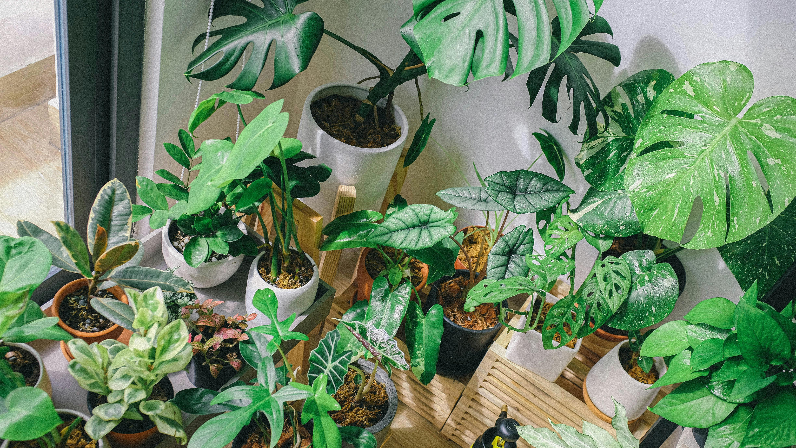
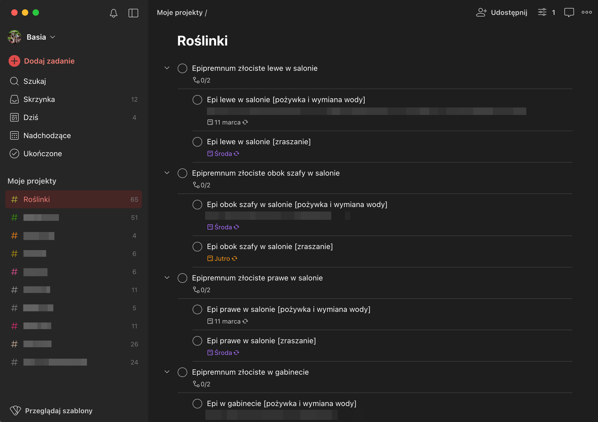
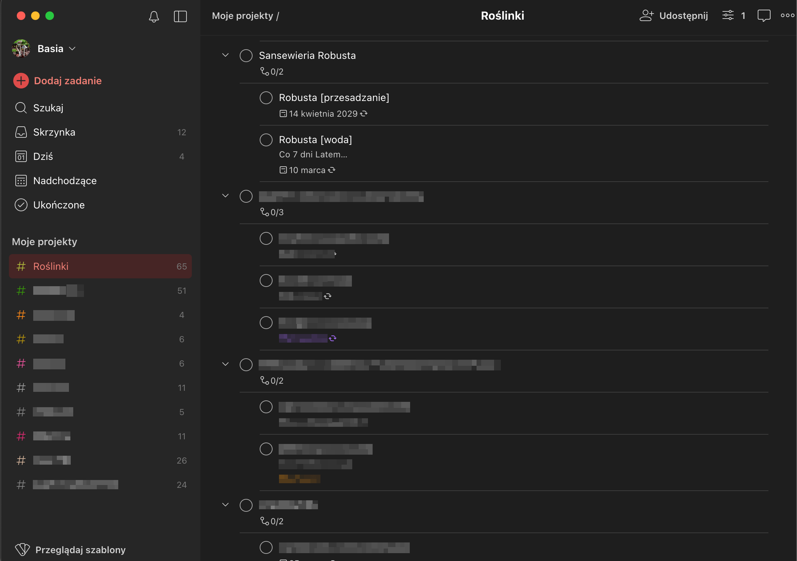
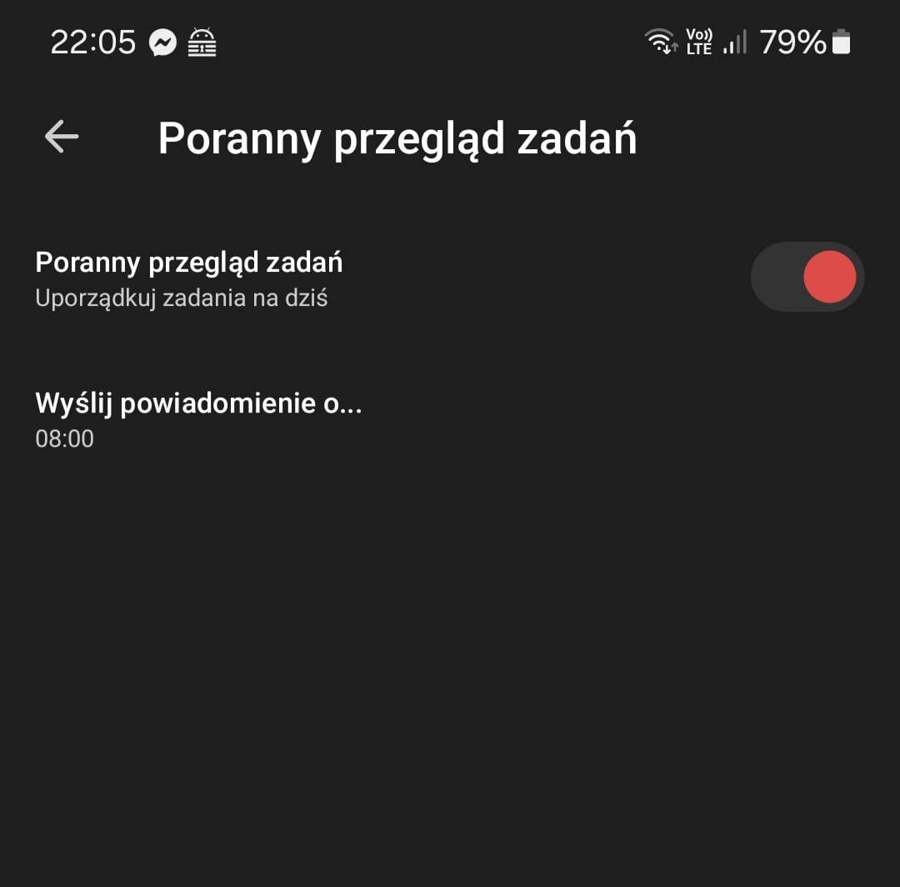
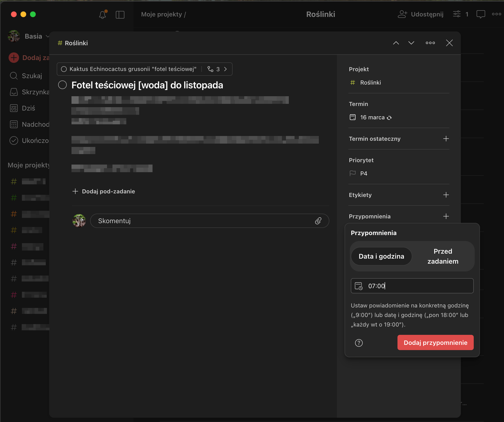
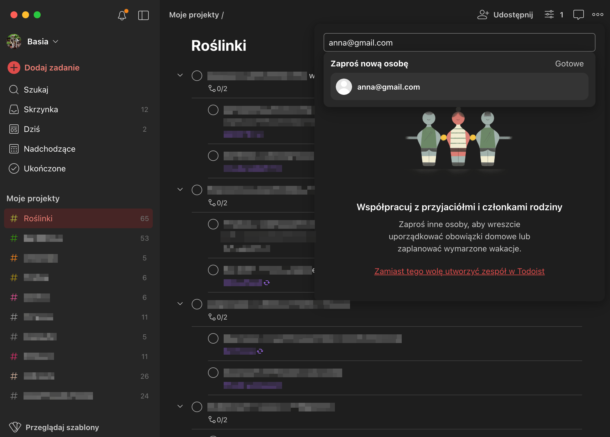

Do mojego résumé - jako jedno z zainteresowań od czasu pandemii - dodaję *utrzymywanie roślin doniczkowych przy życiu*. Takie hobby. Czy da się dbać o domową dżunglę za pomocą aplikacji?

<!-- truncate -->

Próbowałam różnych aplikacji, które miały mi ułatwić pamiętanie o podlewaniu, zraszaniu i przesadzaniu. Przed dłuższym wyjazdem zamontowaliśmy nawet niektórym roślinom automatyczną “kroplówkę” chińskiej produkcji, żeby co dwa tygodnie przez cztery minuty lała im się do doniczek woda. Mimo tego, część mojej domowej dżungli już dawno pożegnała się z tym światem.

Na te rośliny, które przetrwały, mam na szczęście dobry sposób 😁

## Jakiej apki użyć?

Od lat korzystam z aplikacji [Todoist](https://www.todoist.com/), która notabene jest jedną z niewielu apek, za które płacę i to z radością. Na marginesie dodam, że [Todoist](https://www.todoist.com/) jest w zasadzie darmowy. Wersja płatna daje po prostu więcej możliwości.

Załóżmy, że masz w mieszkaniu 20 roślin. Każda z nich potrzebuje różnych ilości wody, niektóre lubią zraszanie, a dwie na zimę musisz chować w piwnicy, z dala od światła. Dbanie o tak różnorodną kolekcję to w zasadzie cały projekt i tego właśnie określenia używają twórcy [Todoist](https://www.todoist.com/).

Jednym z moich projektów w [Todoist](https://www.todoist.com/) są **Roślinki**.

## Jak zorganizować zadania w Todoist?

Dla każdej z moich roślin, w ramach tego samego projektu, stworzyłam osobne zadanie. Każde zadanie składa się z paru podzadań. Weźmy pod lupę sansewierię Robustę.

Do zadania **Robusta** dodałam dwa podzadania: przesadzanie i podlewanie (pewnie dodam wkrótce odrobaczanie, ale to temat na innego posta 🫣). Założyłam, że Robustę trzeba będzie przesadzić raz na pięć lat, a podlać raz w tygodniu. Wpisałam więc z palca *co 5 lat* do podzadania **Robusta [przesadzanie]** i *co 7 dni* do podzadania **Robusta [woda]**.

Powtarzam nazwę rośliny, bo przypomnienie o podlewaniu może pojawić się razem z innymi przypomnieniami o podlaniu czegoś innego. Dzięki nazwie rośliny moja lista rzeczy nie będzie składać się z pięciu zadań o treści **[woda]** 😁

## Konfiguracja

🔧 Na Androidzie możesz ustawić apkę w taki sposób, żeby każdego dnia wyświetlała się lista rzeczy do zrobienia. Żeby to zrobić, wejdź w **Ustawienia > Powiadomienia > Przegląd poranny** i włącz przełącznik **Poranny przegląd zadań**, a następnie wybierz godzinę, o której chcesz otrzymywać przegląd.

Jest to wygodne rozwiązanie, jeśli nie chcesz pamiętać o ręcznym sprawdzaniu listy zadań. Ja jednak wolę włączać apkę wtedy, kiedy chcę, a nie co rano widzieć to samo powiadomienie, dlatego z porannego przeglądu po prostu nie korzystam.

## Co daje wersja płatna?

Użytkownicy premium mogą ustawiać przypomnienia o poszczególnych zadaniach na konkretną godzinę. Może się to przydać, jeśli na przykład musisz podlać kaktusa z samego rana. Możesz wtedy ustawić przypomnienie na 7:00 rano. Bez względu na to, czy [Todoist](https://www.todoist.com/) wyświetla Ci co rano listę rzeczy do zrobienia na dany dzień, otrzymasz powiadomienie o podlaniu tego konkretnego kaktusa o 7:00.

A co jeśli wyjeżdżasz na dłuższe wakacje i chcesz, żeby Twoimi roślinami zaopiekowała się sąsiadka? Możesz zaprosić ją do współpracy w projekcie [Todoist](https://www.todoist.com/). Dzięki temu będzie widzieć, co jest do zrobienia i kiedy.

## Do wszystkiego i NIE do niczego

Im więcej masz roślin, tym trudniej o nie zadbać. Na szczęście dzięki [Todoist](https://www.todoist.com/), dbanie o domową dżunglę staje się banalnie proste. Jasne, trzeba poświęcić trochę czasu na dodanie do projektu wszystkich roślin, ale uwierz mi, warto. Dzięki korzystaniu z apki nie tylko wiem, kiedy i co podlać, ale jeśli z rośliną dzieje się coś złego, mniej więcej wiem, czy wynika to z tego, że podlewam ją za rzadko czy zbyt często.

Oczywiście z [Todoist](https://www.todoist.com/) korzystam nie tylko do opieki nad roślinami. Prowadzę na [Todoist](https://www.todoist.com/) wiele projektów, a skoro jednym z nich mogą być rośliny, to nie muszę instalować do opieki nad nimi osobnej aplikacji. Zresztą nigdy nie znalazłam dedykowanego narzędzia, które spisałoby się lepiej od projektu w [Todoist](https://www.todoist.com/).

🚀 Masz już swój system dbania o rośliny, czy dopiero się nad nim zastanawiasz? Sprawdź [Todoist](https://www.todoist.com/), a rośliny będą Ci za to wdzięczne.
